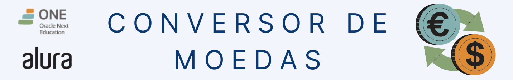
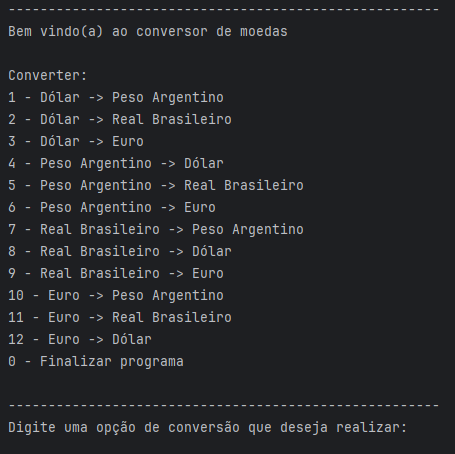
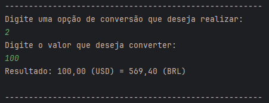
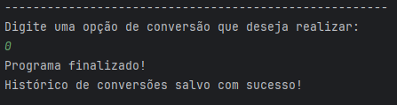
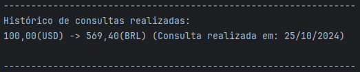

<p align="center">
	
</p>

Um conversor de moedas simples desenvolvido em Java que permite realizar conversões entre diversas moedas usando a ExchangeRate API. O projeto também armazena um histórico de conversões, tornando fácil visualizar as taxas usadas em consultas anteriores. Realizado durante a formação Back-end da [Oracle Next Education (ONE)](https://www.oracle.com/br/education/oracle-next-education/).

## Índice

- [Pré-requisitos](#pré-requisitos)
- [Funcionalidades](#funcionalidades)
- [Instalação](#instalação)
- [Como Usar](#como-usar)
- [Exemplo de Uso](#exemplo-de-uso)
- [Autora](#autora)
- [Licença](#licença)

---

### Pré-requisitos

- Java 17 ou superior
- [Gson](https://github.com/google/gson) - para manipulação de JSON
- Conta e chave de API na [ExchangeRate API](https://www.exchangerate-api.com/) (gratuita para testes)
- [IntelliJ IDEA](https://www.jetbrains.com/pt-br/idea/)


### Funcionalidades

- Conversão de moedas entre **USD**, **BRL**, **ARS** e **EUR**.
- Armazenamento e exibição do histórico de conversões realizadas.
- Histórico salvo em um arquivo para consultas futuras.

### Instalação

1. Clone o repositório para sua máquina local:

    ```bash
    git clone https://github.com/GessycaBorges/conversor-de-moedas-java
    ```

2. Configure sua chave de API:
    - No arquivo `ConversorDeMoedas.java`, substitua `API_KEY` pela sua chave da ExchangeRate API.

3. Instale as dependências do projeto:

   Através do Mvn Repository [Gson](https://mvnrepository.com/artifact/com.google.code.gson/gson). 

### Como Usar
- Ao executar PrincipalConsulta, você verá um menu para escolher a conversão que deseja realizar.
  - Digite o número correspondente à conversão e o valor a ser convertido. 
  - Após a conversão, o resultado será exibido e salvo no histórico.

- Ao executar PrincipalHistorico, o conteúdo do histórico de conversões será exibido no console.

## Exemplo de Uso

### 1. Realizando uma Conversão

- **Passo 1**: Execute o programa `PrincipalConsulta`
- **Passo 2**: O menu de conversão será exibido:



- **Passo 3**: Digite o número da conversão desejada. Por exemplo, se você quiser converter Dólar para Real Brasileiro, digite 2 e pressione Enter.
- **Passo 4**: Em seguida, digite o valor que deseja converter. Por exemplo, se você quiser converter 100 Dólares, digite 100 e pressione Enter.

O resultado da conversão será exibido:



- **Passo 5**: Finalize o programa digitando a opção 0



### 2. Visualizando o Histórico de Conversões

- **Passo 1**: Execute o programa `PrincipalHistorico`
- **Passo 2**: O histórico de conversões realizadas será exibido no console. Por exemplo:



## Autora

<a href="https://www.linkedin.com/in/gessycaborges/">
 <br />
 <sub><a>Gessyca Borges</a></sub></a> <a href="https://www.linkedin.com/in/gessycaborges/" title="Gessyca"></a>
 <br />

 ---

## Licença

Este projeto é de código aberto e pode ser utilizado livremente, sob a licença MIT.